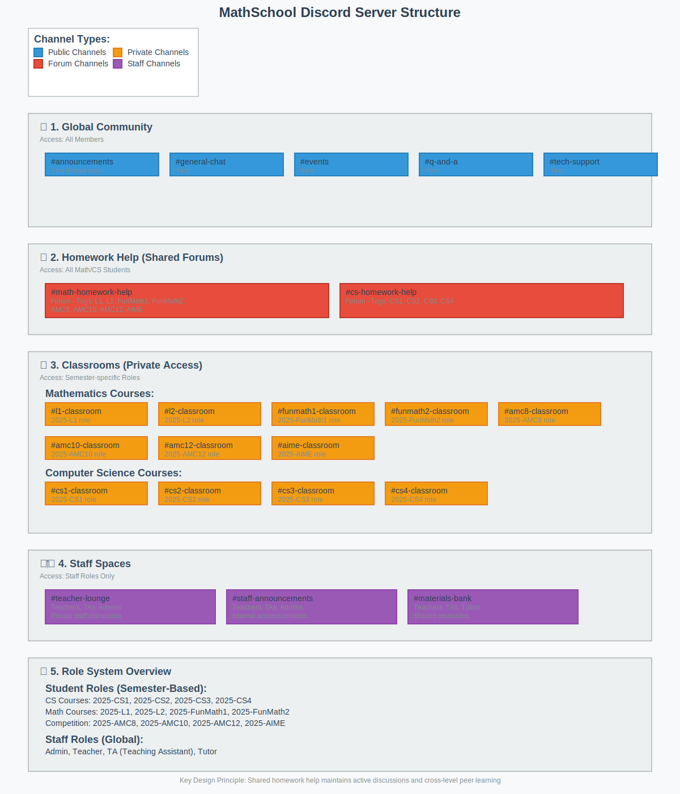

# MathSchool Discord Server Setup Guide

## Overview

This repository contains the complete setup guide for the MathSchool Discord server, designed to foster community learning, peer support, and effective class management across all mathematics and computer science courses.

## 🎯 Design Philosophy

The server structure balances **community engagement** with **organized learning spaces**, featuring:

- **Shared homework help** to maintain active discussions and cross-level peer learning
- **Private classrooms** for course-specific logistics and casual interaction
- **Global community spaces** to build school-wide connections
- **Role-based access** for streamlined management

---

## 🏗️ Server Structure

### 🌐 1. Global Community

**Purpose**: School-wide communication and community building

| Channel | Type | Description |
|---------|------|-------------|
| `#announcements` | Text (Read-only) | School-wide announcements and important updates |
| `#general-chat` | Text | Open discussion for all community members |
| `#events` | Text | School events, competitions, and special activities |
| `#q-and-a` | Text | General questions about school programs and policies |
| `#tech-support` | Text | Discord server technical support and troubleshooting |

**Visibility**: All members

---

### 📘 2. Homework Help (Shared Forums)

**Category**: `Homework Help`

| Channel | Type | Tags Available |
|---------|------|----------------|
| `#math-homework-help` | Forum | `L1`, `L2`, `FunMath1`, `FunMath2`, `AMC8`, `AMC10`, `AMC12`, `AIME` |
| `#cs-homework-help` | Forum | `CS1`, `CS2`, `CS3`, `CS4` |

#### ✅ Why Shared Homework Help Works

**Critical Mass & Activity**
- Prevents individual class channels from becoming inactive
- Ensures questions receive timely responses
- Maintains vibrant discussion environment

**Cross-Level Peer Learning**
- Advanced students reinforce knowledge by helping beginners
- Beginners gain motivation from seeing advanced coursework
- Creates natural mentorship opportunities

**Community & Continuity**
- Students understand their place in the broader learning journey
- Alumni can remain engaged and support new cohorts
- Builds lasting connections across class years

**Simplified Moderation**
- Teachers monitor 2 channels instead of 20+
- Consistent rule enforcement
- Centralized resource management

**Visibility**: All math/CS students regardless of semester

---

### 🏫 3. Classrooms (Private Access)

**Purpose**: Course-specific logistics, casual discussion, and class coordination

#### Mathematics Courses
- `#l1-classroom`
- `#l2-classroom`
- `#funmath1-classroom`
- `#funmath2-classroom`
- `#amc8-classroom`
- `#amc10-classroom`
- `#amc12-classroom`
- `#aime-classroom`

#### Computer Science Courses
- `#cs1-classroom`
- `#cs2-classroom`
- `#cs3-classroom`
- `#cs4-classroom`

#### Classroom Usage Guidelines
- **Teachers**: Post homework assignments and logistics (use pins for important info)
- **Students**: 
  - Casual class-related chat and coordination
  - Class-specific administrative questions
  - **Homework questions**: Redirect to Homework Help forums for better visibility

**Access**: Semester-specific roles (e.g., `2025-CS1`, `2025-L2`)

---

### 👩‍🏫 4. Staff Spaces

**Purpose**: Internal communication and resource sharing

| Channel | Access | Description |
|---------|--------|-------------|
| `#teacher-lounge` | Teachers, TAs, Admins | Private staff discussion space |
| `#staff-announcements` | Teachers, TAs, Admins | Internal announcements and updates |
| `#materials-bank` | Teachers, TAs, Tutors | Shared teaching resources and materials |

---

### 🎭 5. Role System

#### Student Roles (Semester-Based)
- `2025-CS1`, `2025-CS2`, `2025-CS3`, `2025-CS4`
- `2025-L1`, `2025-L2`
- `2025-FunMath1`, `2025-FunMath2`
- `2025-AMC8`, `2025-AMC10`, `2025-AMC12`, `2025-AIME`

#### Staff Roles (Global)
- `Admin` - Full server management
- `Teacher` - Course instruction and moderation
- `TA` - Teaching assistant privileges
- `Tutor` - Homework help moderation

#### Access Logic
- **Homework Help**: Open to all math/CS students
- **Classrooms**: Restricted by semester-class roles
- **Staff Spaces**: Restricted by staff roles
- **Global Community**: Open to all members

---

## 🚀 Quick Start

1. **Set up roles** using the role definitions above
2. **Create channels** following the structure outlined
3. **Configure permissions** based on access requirements
4. **Pin the Server Rules & Culture guide** in `#announcements`
5. **Train staff** on the homework redirect system
6. **Onboard students** with role assignments

---

## 📋 Additional Resources

- [Detailed Setup Instructions](setup-instructions.md)
- [Role Configuration Guide](roles-and-permissions.md)
- [Server Rules & Culture Document](server-rules-culture.md)
- [Channel Management Guide](channel-management.md)

---

## 🎯 Success Metrics

This structure succeeds when:
- Homework questions receive quick, quality responses
- Students feel connected to the broader school community
- Teachers can efficiently manage their classes
- Cross-level peer learning naturally occurs
- The server remains organized and easy to navigate

---

*For questions about this setup, contact the server administrators or post in `#tech-support`.*