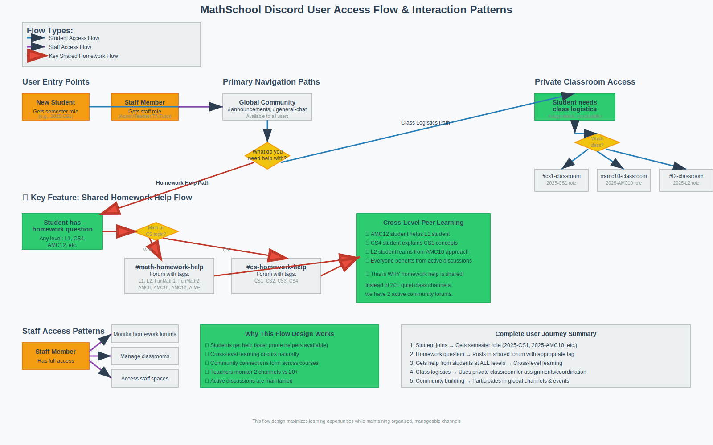

# 📊 MathSchool Discord Channel Management Guide

## Overview

This guide provides best practices for managing channels, moderating content, and maintaining a healthy community environment in the MathSchool Discord server.



---

## 🌐 Global Community Channels Management

### #announcements
**Purpose**: School-wide important communications

#### Content Guidelines:
- ✅ **Include**: School events, policy changes, deadlines, achievements, important updates
- ❌ **Avoid**: Minor updates, class-specific info, casual messages

#### Management Best Practices:
- **Pin important messages** for easy reference
- **Use @everyone sparingly** (major announcements only)
- **Archive old announcements** monthly to keep channel clean
- **Cross-post to website/email** for backup communication
- **Review messages before posting** for clarity and accuracy

#### Posting Schedule:
- **Weekly**: Summary of upcoming events
- **Monthly**: Academic calendar updates
- **As needed**: Emergency notifications, policy changes

### #general-chat
**Purpose**: Casual community interaction

#### Moderation Approach:
- **Light touch moderation** - let conversations flow naturally
- **Redirect homework questions** to appropriate help forums
- **Address conflicts quickly** before they escalate
- **Encourage positive interactions** and celebrate student achievements

#### Content Encouragement:
- Student introductions and getting-to-know-you conversations
- Discussion of math/CS topics outside of homework
- Sharing of interesting articles, videos, or resources
- Casual coordination for study groups or events

### #events
**Purpose**: Academic competitions, workshops, social events

#### Event Posting Template:
```
🎯 **[Event Name]**
📅 **Date**: [Date and Time]
📍 **Location**: [Physical/Virtual location]
👥 **Who**: [Target audience]
📝 **Description**: [Brief event description]
🔗 **Registration**: [Link or process]
❓ **Questions**: [Contact info]
```

#### Management Tasks:
- **Update regularly** with new opportunities
- **Remove outdated events** promptly
- **Create event threads** for discussion and coordination
- **Follow up with results** and photos when appropriate

### #q-and-a
**Purpose**: General school program questions

#### Response Protocol:
- **Staff response within 24 hours** for important questions
- **Student peer responses encouraged** for general questions
- **Direct complex questions** to appropriate staff members
- **Create FAQ document** from frequently asked questions

### #tech-support
**Purpose**: Discord server technical assistance

#### Common Issues & Solutions:
- **Can't see channels**: Check role assignments
- **Notification problems**: Guide through Discord settings
- **Mobile app issues**: Recommend app restart/update
- **Permission errors**: Verify with admin team

---

## 📚 Homework Help Forums Management

### Forum Moderation Philosophy
**Goal**: Create a supportive learning environment where students help each other grow

#### What Makes a Good Homework Help Response:
- ✅ **Guides thinking** rather than giving direct answers
- ✅ **Asks clarifying questions** to understand the student's confusion
- ✅ **Explains reasoning** behind mathematical/coding concepts
- ✅ **Encourages next steps** and builds confidence
- ✅ **Provides relevant resources** for further learning

#### What to Discourage:
- ❌ **Direct answer posting** without explanation
- ❌ **Doing homework for students** completely
- ❌ **Dismissive responses** to "basic" questions
- ❌ **Off-topic discussions** that don't help the original poster

### Tag Management

#### Math Forum Tags:
- **L1**: Pre-Algebra level questions
- **L2**: Algebra/Geometry questions  
- **FunMath1/FunMath2**: Creative math approach problems
- **AMC8/AMC10/AMC12**: Competition math by level
- **AIME**: Advanced competition problems

#### CS Forum Tags:
- **CS1**: Intro programming, basic syntax
- **CS2**: Data structures, algorithms basics
- **CS3**: Advanced algorithms, complexity
- **CS4**: Specialized topics, advanced projects

### Moderation Workflow

#### Daily Tasks (5-10 minutes):
1. **Scan new posts** for inappropriate content
2. **Check for unanswered questions** from previous day
3. **Encourage good responses** with reactions/replies
4. **Redirect misplaced questions** to appropriate tags

#### Weekly Tasks (15-20 minutes):
1. **Archive solved threads** older than 1 week
2. **Review most active tags** for emerging patterns
3. **Update forum templates** if needed
4. **Recognize helpful contributors** publicly

#### Monthly Tasks (30 minutes):
1. **Analyze forum usage statistics** (which tags most active)
2. **Update tag descriptions** if needed
3. **Create summary posts** of common Q&A topics
4. **Gather feedback** from students about forum effectiveness

### Encouraging Quality Participation

#### For Students Asking Questions:
- **Praise detailed questions** that show work attempted
- **Guide improvement** for vague questions gently
- **Follow up** on solutions to ensure understanding
- **Encourage tagging** appropriate course levels

#### For Students Helping Others:
- **Recognize excellent explanations** publicly
- **Provide feedback** on teaching approaches
- **Connect helpers** with tutoring opportunities
- **Feature outstanding responses** in announcements

---

## 🏫 Classroom Channel Management

### Channel Purpose
**Private spaces for course-specific logistics and coordination**

### Content Guidelines for Teachers:

#### What to Pin:
- **Homework assignments** with due dates
- **Course syllabus** and important policies  
- **Frequently referenced resources** (textbooks, websites)
- **Class schedule changes** or important announcements
- **Project guidelines** and rubrics

#### Regular Posting Suggestions:
- **Weekly homework assignments** (with clear formatting)
- **Upcoming test dates** and study guides
- **Class reflection prompts** to encourage engagement
- **Resource sharing** (useful videos, articles, practice problems)

### Student Engagement Strategies:

#### Encouraging Participation:
- **Ask open-ended questions** about course topics
- **Share interesting real-world applications** of course material
- **Create study group coordination** opportunities
- **Celebrate student achievements** and breakthroughs

#### Managing Off-Topic Content:
- **Gently redirect** homework questions to help forums
- **Allow casual conversation** that builds class community
- **Address conflicts** quickly and privately when possible
- **Set clear expectations** about appropriate channel use

### Classroom Channel Templates

#### Homework Assignment Post:
```
📋 **Week [X] Homework - Due [Date]**

📚 **Assignment**: [Brief description]
📖 **Problems**: [Specific problems or page numbers]
⏰ **Due**: [Date and time]
❓ **Questions**: Post in #math-homework-help or #cs-homework-help with the [CourseTag]

💡 **Tips**: [Any helpful hints or reminders]
🔗 **Resources**: [Links to helpful materials if applicable]
```

#### Class Announcement Template:
```
📢 **Class Update - [Date]**

[Announcement content]

📌 [Any action items for students]
❓ Questions? Ask here or see me after class!
```

---

## 👩‍🏫 Staff Channel Management

### #teacher-lounge
**Private space for instructor collaboration**

#### Encouraged Discussions:
- **Pedagogical strategies** and teaching techniques
- **Student progress concerns** (keep confidential)
- **Curriculum coordination** across courses
- **Professional development** opportunities
- **Resource sharing** and lesson planning

#### Guidelines:
- **Maintain confidentiality** about specific students
- **Keep discussions professional** and constructive
- **Share successful strategies** with colleagues
- **Ask for help** when facing challenges

### #staff-announcements
**Internal administrative updates**

#### Content Types:
- **Policy changes** affecting staff
- **Training opportunities** and requirements
- **Schedule changes** and calendar updates
- **Recognition** of staff achievements
- **Administrative deadlines** and requirements

### #materials-bank
**Shared teaching resources**

#### Organization Tips:
- **Use descriptive file names** (Course_Topic_Date format)
- **Create threads** for different subjects/topics
- **Tag resources** by difficulty level or course
- **Regular cleanup** of outdated materials
- **Version control** for frequently updated resources

---

## 🔧 Technical Management

### Bot Configuration

#### Recommended Bots and Settings:
1. **MEE6 or Carl-bot**
   - Auto-moderation for spam/inappropriate content
   - Welcome messages for new members
   - Role assignment reactions
   - Custom commands for frequently asked questions

2. **Ticket Tool**
   - Private support channels for sensitive issues
   - Automatic transcript generation
   - Staff notification system

3. **Poll Bot**
   - Course feedback surveys
   - Event planning polls
   - Democratic decision-making for community features

### Channel Settings Optimization

#### Thread Management:
- **Auto-archive duration**: 1 week for homework help
- **Slowmode settings**: 
  - Announcements: 10 minutes
  - Events/Q&A: 30 seconds
  - General chat: No slowmode
  - Homework help: 10 seconds

#### Notification Management:
- **@everyone usage**: Restrict to Admin/Teacher roles only
- **@here usage**: Allow for Teachers in classroom channels
- **Role mentions**: Enable for course-specific announcements

### Security and Moderation

#### Auto-Moderation Rules:
- **Spam protection**: Auto-delete repeated messages
- **Link filtering**: Block suspicious domains
- **Language filtering**: Warn for inappropriate language
- **Image filtering**: Flag inappropriate content for review

#### Manual Moderation Guidelines:
- **First offense**: Warning and explanation
- **Second offense**: Temporary mute (24 hours)
- **Severe violations**: Immediate ban with admin review
- **Academic dishonesty**: Report to academic staff

---

## 📊 Community Health Monitoring

### Key Metrics to Track

#### Activity Metrics:
- **Daily active users** in each channel
- **Message volume** in homework help forums
- **Response time** to student questions
- **Participation rates** by course/role

#### Quality Metrics:
- **Helpful response ratio** (reactions/responses)
- **Question resolution rate** in help forums
- **Community feedback** scores
- **Staff workload balance**

### Monthly Community Health Report

#### Template:
```
📊 **MathSchool Discord - Monthly Report**

👥 **Community Growth**:
- New members: [X]
- Active daily users: [X]
- Most active channels: [List]

📚 **Homework Help Activity**:
- Questions asked: [X]
- Response rate: [X]%
- Most common topics: [List]

🎯 **Engagement Highlights**:
- [Notable community interactions]
- [Student achievements to celebrate]
- [Successful initiatives]

⚠️ **Areas for Improvement**:
- [Issues identified]
- [Proposed solutions]
- [Action items for next month]
```

### Feedback Collection

#### Regular Feedback Methods:
- **Monthly polls** about server experience
- **Anonymous suggestion box** via bot commands
- **Focus groups** with student representatives
- **Staff retrospectives** on channel effectiveness

#### Acting on Feedback:
- **Acknowledge all feedback** received
- **Implement feasible suggestions** within 2 weeks
- **Explain decisions** when suggestions aren't implemented
- **Follow up** on changes made

---

## 🚀 Growth and Improvement

### Seasonal Adjustments

#### Start of Semester:
- **Create new course roles** and channels
- **Archive old semester channels** 
- **Update welcome messages** with current info
- **Refresh pinned content** in all channels

#### Mid-Semester:
- **Review channel usage** patterns
- **Adjust moderation** based on community needs  
- **Plan community events** to boost engagement
- **Check in with less active members**

#### End of Semester:
- **Celebrate achievements** and milestones
- **Collect comprehensive feedback** on server experience
- **Plan improvements** for next semester
- **Archive completed coursework** discussions

### Community Building Initiatives

#### Monthly Ideas:
- **Student spotlight** features in announcements
- **Math/CS challenge** of the month
- **Study buddy matchmaking** events
- **Virtual study halls** with music bots

#### Special Events:
- **Competition prep sessions** for AMC/programming contests
- **Guest speaker** Q&A sessions
- **Collaborative projects** across different courses
- **Community game nights** with educational games

---

## 🆘 Crisis Management

### Handling Conflicts
1. **Address immediately** before escalation
2. **Move to private channels** for sensitive discussions
3. **Listen to all parties** involved
4. **Focus on resolution** rather than blame
5. **Follow up** to ensure issues are resolved

### Emergency Response Protocol
- **Major technical issues**: Contact Discord support immediately
- **Inappropriate content**: Remove first, investigate second
- **Harassment reports**: Take seriously, investigate thoroughly
- **Academic integrity concerns**: Involve academic staff immediately

### Communication During Issues
- **Acknowledge problems** quickly and transparently  
- **Provide regular updates** on resolution progress
- **Explain preventive measures** being implemented
- **Thank community** for patience and support

---

## 📞 Resources and Support

### Internal Resources
- [Server Rules & Culture Guide](server-rules-culture.md)
- [Setup Instructions](setup-instructions.md)
- [Roles & Permissions Reference](roles-and-permissions.md)
- [Main Documentation](README.md)

### External Resources
- Discord's Community Management Guide
- Educational Discord Server Best Practices
- Discord Moderation Tools Documentation
- Academic Community Building Resources

### Getting Help
- **Technical issues**: #tech-support channel
- **Policy questions**: DM admin team
- **Teaching strategies**: #teacher-lounge
- **Community feedback**: Monthly feedback forms

---

*This guide is a living document. Update regularly based on community needs and Discord feature changes.*

---

*Last Updated: August 2025*
*Version: 1.0 - Initial Release*