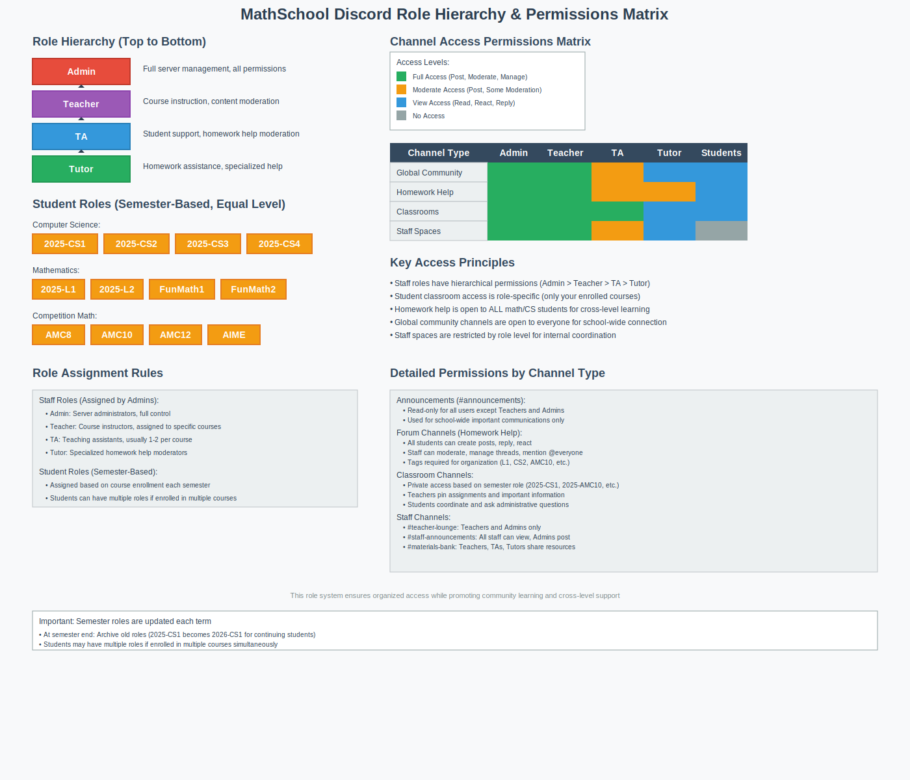

# 🎭 MathSchool Discord Roles & Permissions Reference

## Quick Reference Guide

This document provides a comprehensive reference for all roles, permissions, and access levels in the MathSchool Discord server.



---

## 👑 Staff Role Hierarchy

### 1. Admin
- **Color**: <span style="display: inline-block; width: 20px; height: 20px; background-color: #FF0000; border: 1px solid #000; vertical-align: middle; margin-right: 8px;"></span>Red (#FF0000)
- **Position**: Highest
- **Key Permissions**: Administrator (all permissions)
- **Access**: All channels and features
- **Responsibilities**: Server management, user management, bot configuration
- **Mentionable**: No (to prevent spam)

### 2. Teacher  
- **Color**: <span style="display: inline-block; width: 20px; height: 20px; background-color: #9932CC; border: 1px solid #000; vertical-align: middle; margin-right: 8px;"></span>Purple (#9932CC)
- **Position**: Below Admin
- **Key Permissions**: Manage Channels, Manage Messages, Kick Members, Mute Members
- **Access**: All channels, can post in announcements
- **Responsibilities**: Course instruction, content moderation, student guidance
- **Mentionable**: Yes

### 3. TA (Teaching Assistant)
- **Color**: <span style="display: inline-block; width: 20px; height: 20px; background-color: #0000FF; border: 1px solid #000; vertical-align: middle; margin-right: 8px;"></span>Blue (#0000FF)
- **Position**: Below Teacher
- **Key Permissions**: Manage Messages, Mute Members
- **Access**: All student areas, staff areas except teacher-lounge
- **Responsibilities**: Student support, homework help moderation
- **Mentionable**: Yes

### 4. Tutor
- **Color**: <span style="display: inline-block; width: 20px; height: 20px; background-color: #008000; border: 1px solid #000; vertical-align: middle; margin-right: 8px;"></span>Green (#008000)
- **Position**: Below TA
- **Key Permissions**: Manage Messages (homework help channels only)
- **Access**: Homework help forums, materials-bank
- **Responsibilities**: Homework assistance, peer tutoring coordination
- **Mentionable**: Yes

---

## 🎓 Student Semester Roles

### Computer Science Courses
| Role | Color | Access | Typical Enrollment |
|------|-------|--------|-------------------|
| `2025-CS1` | <span style="display: inline-block; width: 16px; height: 16px; background-color: #FF6B6B; border: 1px solid #000; vertical-align: middle; margin-right: 6px;"></span>#FF6B6B (Red) | cs1-classroom, homework help | Intro CS students |
| `2025-CS2` | <span style="display: inline-block; width: 16px; height: 16px; background-color: #FF8E53; border: 1px solid #000; vertical-align: middle; margin-right: 6px;"></span>#FF8E53 (Orange) | cs2-classroom, homework help | Data Structures |
| `2025-CS3` | <span style="display: inline-block; width: 16px; height: 16px; background-color: #FF6B9D; border: 1px solid #000; vertical-align: middle; margin-right: 6px;"></span>#FF6B9D (Pink) | cs3-classroom, homework help | Algorithms |
| `2025-CS4` | <span style="display: inline-block; width: 16px; height: 16px; background-color: #C44569; border: 1px solid #000; vertical-align: middle; margin-right: 6px;"></span>#C44569 (Dark Red) | cs4-classroom, homework help | Advanced Topics |

### Mathematics Courses  
| Role | Color | Access | Typical Enrollment |
|------|-------|--------|-------------------|
| `2025-L1` | <span style="display: inline-block; width: 16px; height: 16px; background-color: #4834D4; border: 1px solid #000; vertical-align: middle; margin-right: 6px;"></span>#4834D4 (Purple) | l1-classroom, homework help | Pre-Algebra |
| `2025-L2` | <span style="display: inline-block; width: 16px; height: 16px; background-color: #6C5CE7; border: 1px solid #000; vertical-align: middle; margin-right: 6px;"></span>#6C5CE7 (Light Purple) | l2-classroom, homework help | Algebra/Geometry |
| `2025-FunMath1` | <span style="display: inline-block; width: 16px; height: 16px; background-color: #A55EEA; border: 1px solid #000; vertical-align: middle; margin-right: 6px;"></span>#A55EEA (Magenta) | funmath1-classroom, homework help | Creative Math 1 |
| `2025-FunMath2` | <span style="display: inline-block; width: 16px; height: 16px; background-color: #FD79A8; border: 1px solid #000; vertical-align: middle; margin-right: 6px;"></span>#FD79A8 (Pink) | funmath2-classroom, homework help | Creative Math 2 |
| `2025-AMC8` | <span style="display: inline-block; width: 16px; height: 16px; background-color: #00B894; border: 1px solid #000; vertical-align: middle; margin-right: 6px;"></span>#00B894 (Teal) | amc8-classroom, homework help | Middle School Competition |
| `2025-AMC10` | <span style="display: inline-block; width: 16px; height: 16px; background-color: #00CEC9; border: 1px solid #000; vertical-align: middle; margin-right: 6px;"></span>#00CEC9 (Cyan) | amc10-classroom, homework help | High School Competition |
| `2025-AMC12` | <span style="display: inline-block; width: 16px; height: 16px; background-color: #81ECEC; border: 1px solid #000; vertical-align: middle; margin-right: 6px;"></span>#81ECEC (Light Cyan) | amc12-classroom, homework help | Advanced Competition |
| `2025-AIME` | <span style="display: inline-block; width: 16px; height: 16px; background-color: #74B9FF; border: 1px solid #000; vertical-align: middle; margin-right: 6px;"></span>#74B9FF (Blue) | aime-classroom, homework help | Elite Competition |

### Student Role Properties
- **Permissions**: Default (@everyone permissions)
- **Hoist**: No (doesn't show separately in member list)
- **Mentionable**: Yes
- **Multiple Roles**: Students can have multiple course roles

---

## 🏗️ Channel Access Matrix

### Global Community Channels

| Channel | @everyone | Students | Staff | Special Notes |
|---------|-----------|----------|-------|---------------|
| `#announcements` | 👁️ View Only | 👁️ View Only | ✍️ Post & Manage | Read-only for non-staff |
| `#general-chat` | ✍️ Full Access | ✍️ Full Access | ✍️ Full Access | Open discussion |
| `#events` | ✍️ Full Access | ✍️ Full Access | ✍️ Full Access | 30s slowmode |
| `#q-and-a` | ✍️ Full Access | ✍️ Full Access | ✍️ Full Access | 30s slowmode |
| `#tech-support` | ✍️ Full Access | ✍️ Full Access | ✍️ Full Access | No slowmode |

### Homework Help Forums

| Channel | Access Level | Available Tags | Moderation |
|---------|--------------|----------------|------------|
| `#math-homework-help` | All math/CS students | L1, L2, FunMath1, FunMath2, AMC8, AMC10, AMC12, AIME | Staff + Tutors |
| `#cs-homework-help` | All math/CS students | CS1, CS2, CS3, CS4 | Staff + Tutors |

**Forum Permissions for Students**:
- ✅ View Channel, Create Threads, Post in Threads, React, Upload Files
- ❌ Manage Messages, Delete Others' Posts, Manage Threads

### Classroom Channels (Private)

| Channel | Course Role Required | Staff Access | Purpose |
|---------|---------------------|--------------|---------|
| `#l1-classroom` | 2025-L1 | All Staff | L1 course logistics |
| `#l2-classroom` | 2025-L2 | All Staff | L2 course logistics |
| `#funmath1-classroom` | 2025-FunMath1 | All Staff | FunMath1 logistics |
| `#funmath2-classroom` | 2025-FunMath2 | All Staff | FunMath2 logistics |
| `#amc8-classroom` | 2025-AMC8 | All Staff | AMC8 preparation |
| `#amc10-classroom` | 2025-AMC10 | All Staff | AMC10 preparation |
| `#amc12-classroom` | 2025-AMC12 | All Staff | AMC12 preparation |
| `#aime-classroom` | 2025-AIME | All Staff | AIME preparation |
| `#cs1-classroom` | 2025-CS1 | All Staff | CS1 course logistics |
| `#cs2-classroom` | 2025-CS2 | All Staff | CS2 course logistics |
| `#cs3-classroom` | 2025-CS3 | All Staff | CS3 course logistics |
| `#cs4-classroom` | 2025-CS4 | All Staff | CS4 course logistics |

### Staff Channels

| Channel | Admin | Teacher | TA | Tutor | Purpose |
|---------|-------|---------|----|----- |---------|
| `#teacher-lounge` | ✅ | ✅ | ❌ | ❌ | Private teacher discussion |
| `#staff-announcements` | ✍️ Post | 👁️ View | 👁️ View | 👁️ View | Internal announcements |
| `#materials-bank` | ✅ | ✅ | ✅ | ✅ | Shared resources |

---

## ⚙️ Detailed Permission Breakdown

### Forum Channel Permissions

**@everyone (Base Permissions)**:
```
View Channel: ✅
Send Messages: ❌ (Forums use threads)
Send Messages in Threads: ✅
Create Public Threads: ✅
Create Private Threads: ❌
Manage Messages: ❌
Manage Threads: ❌
Embed Links: ✅
Attach Files: ✅
Read Message History: ✅
Mention Everyone: ❌
Use External Emoji: ✅
Add Reactions: ✅
```

**Staff Overrides (Teachers, TAs, Tutors, Admins)**:
```
All above permissions: ✅
Manage Messages: ✅
Manage Threads: ✅
Mention Everyone: ✅ (Teachers/Admins only)
Pin Messages: ✅
```

### Classroom Channel Permissions

**Course Role (e.g., 2025-CS1)**:
```
View Channel: ✅
Send Messages: ✅
Read Message History: ✅
Embed Links: ✅
Attach Files: ✅
Use External Emoji: ✅
Add Reactions: ✅
Create Public Threads: ✅
Send Messages in Threads: ✅
```

**@everyone (Explicitly Denied)**:
```
View Channel: ❌
```

---

## 🔧 Common Permission Issues & Solutions

### Issue: Student can't see homework help
**Likely Causes**:
- Channel permissions incorrectly set
- Category permissions overriding channel settings
- Student role missing or incorrect

**Solutions**:
1. Check category "Homework Help" permissions
2. Ensure @everyone can view channels in category
3. Verify student has appropriate course role

### Issue: Student can access wrong classroom
**Likely Causes**:
- Multiple semester roles assigned incorrectly
- Permission override on wrong channel
- Role hierarchy issues

**Solutions**:
1. Audit student's assigned roles
2. Check channel permission overrides
3. Remove outdated semester roles

### Issue: Staff can't moderate
**Likely Causes**:
- Staff role below student roles in hierarchy
- Missing key permissions on staff role
- Channel permission overrides blocking staff

**Solutions**:
1. Move staff roles above all student roles
2. Add "Manage Messages" permission to staff roles
3. Check for channel-specific permission blocks

### Issue: Forum tags not working
**Likely Causes**:
- "Require Tag" setting disabled
- Insufficient permissions to create posts
- Tag permissions incorrect

**Solutions**:
1. Enable "Require Tag" in forum settings
2. Check thread creation permissions
3. Verify tag colors and names are set correctly

---

## 📊 Role Assignment Best Practices

### New Student Onboarding
1. **Verify enrollment** before assigning course roles
2. **Assign only current semester roles** (remove old ones)
3. **Multiple courses** = multiple roles OK
4. **Document role assignments** for future reference

### Role Maintenance Schedule

**Weekly**:
- Review role assignment requests
- Clean up test/temporary roles

**Monthly**: 
- Audit student enrollments vs. Discord roles
- Remove roles for withdrawn students

**Semester End**:
- Archive old semester roles
- Create new semester roles (update year)
- Bulk update continuing students

**Annual**:
- Full permission audit
- Role color/naming review
- Documentation update

### Bulk Role Management

**Recommended Tools**:
- Carl-bot (bulk role assignment)
- MEE6 (reaction role system)
- Dyno (server management)

**Manual Process**:
1. Export member list with roles
2. Create spreadsheet for new assignments  
3. Use Discord's member search/filter
4. Apply roles in batches

---

## 🆘 Emergency Procedures

### Lost Admin Access
1. **Contact Discord Support** with server ID
2. **Use backup admin account** if configured
3. **Transfer ownership** to trusted staff member
4. **Document incident** for future prevention

### Mass Permission Issues
1. **Check recent role changes** in audit log
2. **Reset category permissions** to defaults
3. **Rebuild channel permissions** systematically
4. **Test with alternate account** before going live

### Bot Permission Problems
1. **Check bot role position** in hierarchy
2. **Verify bot permissions** match requirements
3. **Re-invite bot** if permissions corrupted
4. **Use backup bot** for critical functions

---

## 📋 Quick Commands Reference

### Useful Discord Commands
```
/permissions @user #channel - Check user permissions
/role add @user RoleName - Add role to user
/role remove @user RoleName - Remove role from user
/ban @user reason - Ban user (Teacher/Admin only)
/kick @user reason - Kick user (Teacher/Admin only)
/timeout @user duration - Temporary mute
```

### Role Management Commands (with bots)
```
!role @user add RoleName - Add role
!role @user remove RoleName - Remove role
!role list - Show all roles
!permissions @user - Show user permissions
```

---

## 📞 Support Contacts

**Server Administration Issues**:
- Contact: Server Admin Team
- Channel: #tech-support
- Priority: High

**Permission Problems**:
- Contact: Teachers or Admins
- Channel: #staff-announcements
- Priority: Medium

**Role Assignment Requests**:
- Contact: Any Staff Member
- Channel: #tech-support or DM
- Priority: Low-Medium

---

## 📚 Related Documentation

For complete server setup and management information:

- **[📋 Main Documentation](README.md)** - Complete server structure overview and design philosophy
- **[📜 Server Rules & Culture](server-rules-culture.md)** - Community guidelines and user expectations
- **[🛠️ Setup Instructions](setup-instructions.md)** - Step-by-step implementation guide
- **[📊 Channel Management](channel-management.md)** - Ongoing moderation and community building

---

*Last Updated: August 2025*
*Version: 1.0 - Initial Release*